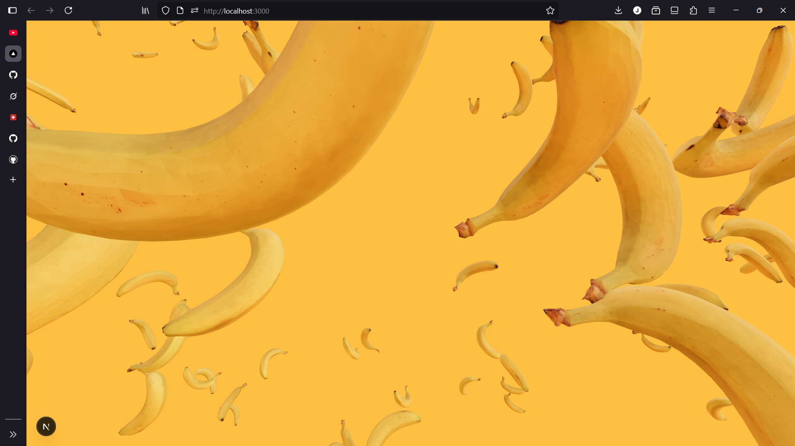

# Trying react three fibre for the first time
- This is a new experience. 😁

### How it started

## My thoughts on this.
- This is really cool. Always nice to learn something new.
- Requires a lot of power. 🚀
- T'was lagging a lot so I had to comment out the EffectComposer. 😓

### To do
- [x] Built this website.
- [ ] Built it again on my own to fully understand it.
- [ ] Add some content.
- [ ] Add animations using framer-motion.
